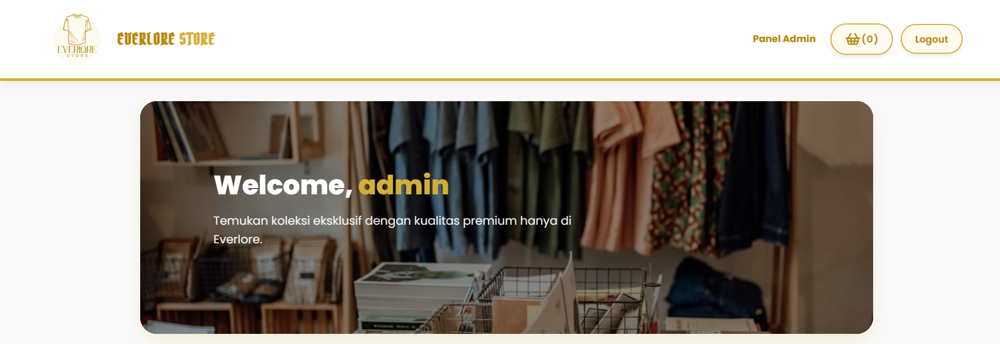
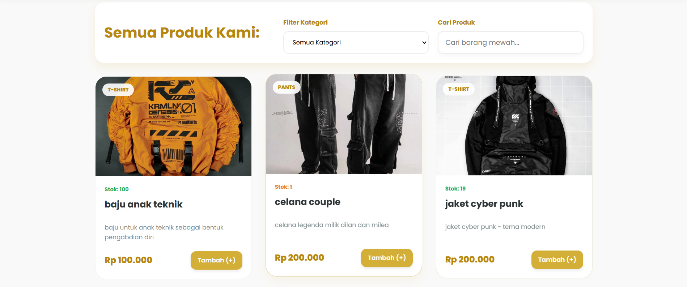
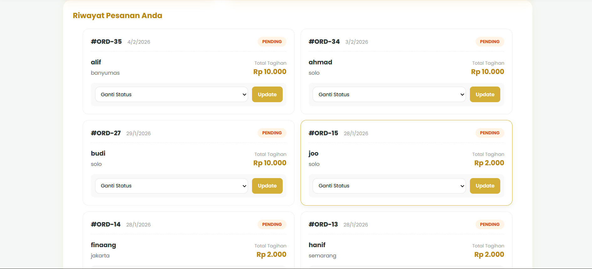
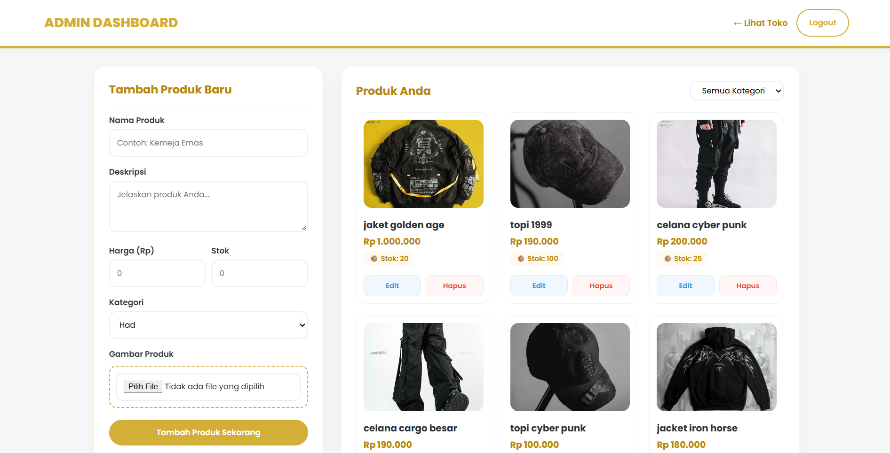

# 🛍️ Everlore Store


**Everlore Store** adalah web toko baju online dengan tampilan modern dan responsif, dibuat sebagai project pembelajaran sekaligus fondasi untuk pengembangan e-commerce fashion.

Project ini cocok untuk:
- Portofolio frontend / fullstack
- Contoh web toko online sederhana
- Basis pengembangan toko baju digital

---

## ✨ Fitur Utama

- 🛒 Katalog produk pakaian
- 📱 Desain responsif (mobile & desktop)
- 🎨 UI clean dan modern
- ⚙️ Struktur kode sederhana & mudah dipelajari
- 🚀 Siap dikembangkan ke sistem backend & pembayaran

---

## 📸 Screenshot Website

## 📸 Screenshot Website

### Halaman Home



### Order Page


### Admin Dashboard


---
---

## 🚀 Cara Menjalankan Project

### 1. Clone repository
```bash
git clone https://github.com/artebelajar/everlore-store.git
```